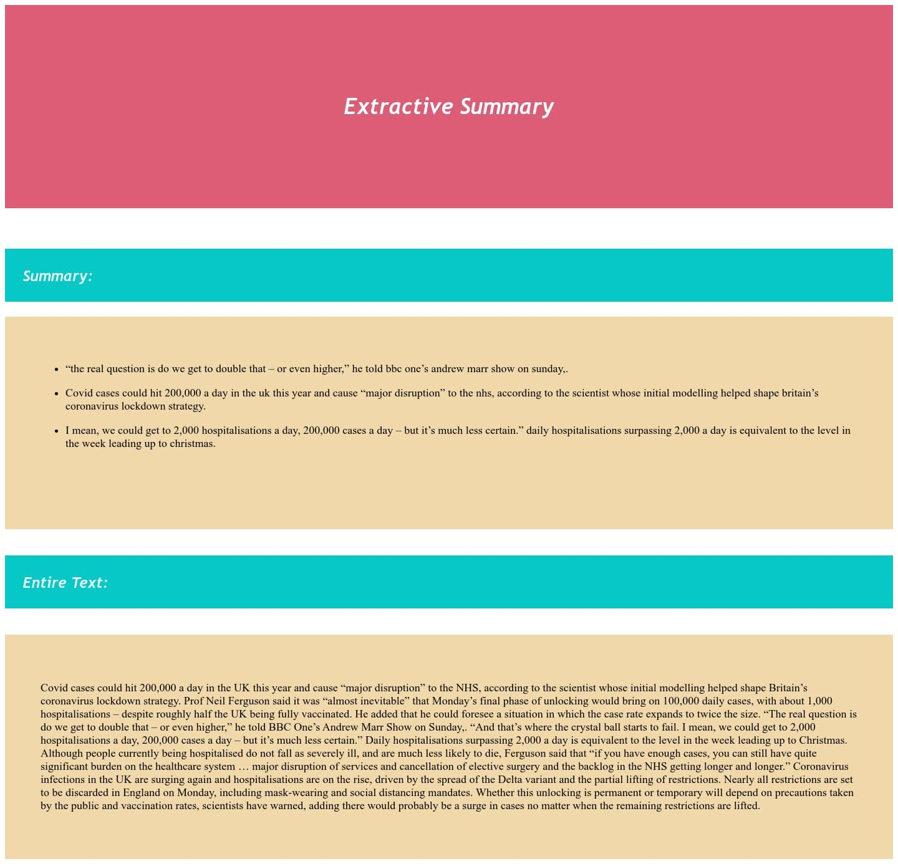
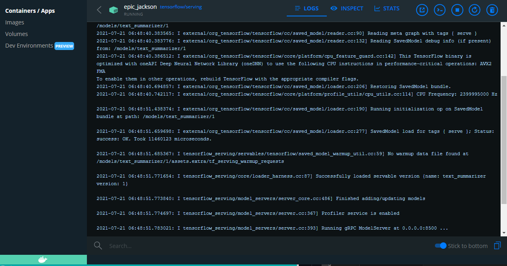

# text-summarizer

### Desccription
*An AI application built over Google's BERT model that can produce an extractive summary of a text.*

### Table of Contents 
* [Setup](#setup)
* [Functionality](#functionality)
* [Technology](#technology)
* [AI in Action ](#ai-in-action)
* [Sources](#sources)

### Setup
Follow these steps to setup the application on your system - 

#### Docker 
* 1) Install Docker on your PC (https://docs.docker.com/engine/install/)
* 2) Host your choice of TensorFlow model using Docker (the preprocessing is done for the model - ExtractiveSummarizer_v1_40_words)
  * Create a variable in your terminal - in windows powershell - ```$ Set-Variable -Name MODEL_PATH -Value "path/to/model"```
  * Pull tensorflow/serving image  - `$ docker pull tensorflow/tensorflow`
  * Run the tensorflow/serving image - `$ docker run -t --rm -d -p 8501:8501 -v   "$MODEL_PATH:/models/ExtractiveSummarizer_v1_40_words" -e MODEL_NAME=ExtractiveSummarizer_v1_40_words tensorflow/serving`
  * For any further reference to Tensorflow Serving, check out the following link to Docker documentation (https://www.tensorflow.org/install/docker)

#### Python 
**Have Python installed on your system (if not installed, use this https://www.python.org/downloads/)
Install the following packages globally in python**
* json 
* os
* numpy 
* nltk
* tensorflow 

 
#### Nodejs

* 1) Have nodejs installed in your system
* 2) Run `$ node index.js`
* 3) The application will be hosted on localhost:5000

### Functionality 
* The Tensorflow/serving image serves the tensorflow model (whose building will be posted in another repository) at the REST port (8501)
* The Nodejs Express application build a server which takes in the article to be summarized at '/summarize.html'
* On hitting the 'Summarize' button, the python scripts in the backend run the preprocessing steps to convert the input into a format that the A.I model can understand. This preprocessed string is then saved. 
* The Express application then uses this preprocessed string to send a post request to the A.I model hosted at port 8501 and receives predictions. 
* The Express application then uses these predictions to produce an extractive summarization of the given input. 
* This summary is then posted onto '/summary.html' page.

### Technology 
* JavaScript 
  - Nodejs
  - Express 
  - Child process
  - Ejs
  - Server side rendering 
* Python 
  - numpy 
  - nltk 
  - TensorFlow 
  - bert uncased model  
  - custom A.I model building 
* Docker 
  - TensorFlow/serving
  - Keras A.I model hosting  


### AI in Action

* The Guardian article given in the [Sources section](#sources) has been put into the system.
* Homepage

* Summary Page

* Docker Tensorflow Model Hosting 



### Sources 
* 1) Guardian Article considered in [AI in Action](#ai-in-action) section (https://www.theguardian.com/world/2021/jul/18/uk-covid-cases-could-hit-200000-a-day-says-neil-ferguson-scientist-behind-lockdown-strategy-england)
* 2) Google BERT (https://blog.google/products/search/search-language-understanding-bert/)
* 3) Repositories performing extractive summarization (https://github.com/dmmiller612/bert-extractive-summarizer)
* 4) Docker installation documentation (https://docs.docker.com/engine/install/)
* 5) Tensorflow Serving documentation (https://www.tensorflow.org/install/docker)
* 6) Python Installation (https://www.python.org/downloads/)
* 7) Tensorflow Installation (https://www.tensorflow.org/install)
* 8) TFHUB link for BERT uncased (https://tfhub.dev/google/bert_uncased_L-12_H-768_A-12/1)

